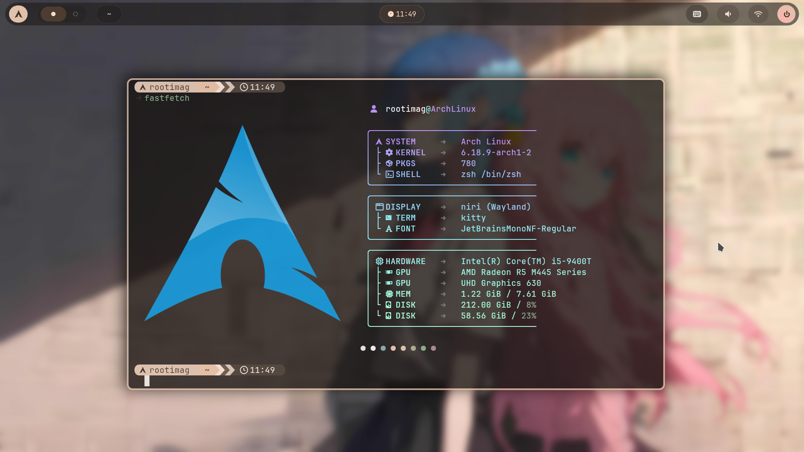

# 🎨 Dotfiles: Material You Everywhere

[](https://github.com/InioX/matugen)
[](https://opensource.org/licenses/MIT)

这是我的个人配置文件仓库。本配置采用 **Matugen** 作为核心引擎，实现动态色彩同步。

---

## ✨ 核心特性

- **告别固定色系**：彻底移除硬编码的颜色值，所有 UI 颜色均根据壁纸动态计算。
- **Material You 逻辑**：基于壁纸主色调生成和谐的调色板（Accents, Surfaces, Containers）。
- **极简维护**：只需更换壁纸，终端、窗口管理器和应用脚本会自动更新。
- **美观整洁**: 配置文件全部遵循 XDG 规范，且有详细注释，除 Matugen 和 scripts 外配置文件关联性较低，便于移植

## 🛠 已实现应用

| 类别 | 工具 | 
| --- | --- |
| Wayland 合成器 | [niri](https://github.com/niri-wm/niri) |
| rofi 应用启动器 | [rofi](https://github.com/davatorium/rofi) |
| ironbar 状态栏 | [ironbar](https://github.com/JakeStanger/ironbar) |
| btop 终端进程查看 | [btop](https://github.com/aristocratos/btop) |
| ptwalfox 浏览器美化 | [firefox](https://github.com/mozilla-firefox/firefox) |
| kitty 终端模拟器 | [kitty](https://github.com/kovidgoyal/kitty) |
| nvim 文件编辑器 | [nvim](https://github.com/neovim/neovim) |
| mako 通知 | [mako](https://github.com/sqlalchemy/mako) |
| yazi 终端文件管理器 | [yazi](https://github.com/sxyazi/yazi) |
| wlogout 关机管理器 | [wlogout](https://github.com/ArtsyMacaw/wlogout) |
| zsh Shell | zsh |
| fastfetch 快速获取信息 | [fastfetch](https://github.com/fastfetch-cli/fastfetch) | 

---

## 🚀 快速开始

在安装指南有 **[详细介绍](./INSTALL.md)**

---

## 📂 项目结构

```
.
├── scripts/                # 共用脚本，包括 matugen 更新和截图
├── matugen/                # matugen 色彩动态更新 (模板与配置)
├── niri/                   # niri 窗口管理器配置
├── rofi/                   # rofi 启动器配置
├── ironbar/                # ironbar 状态栏配置
├── btop/                   # btop 系统监控配置
├── ptwalfox/               # firefox 动态色彩定制 (Potatofox)
├── gtk/                    # gtk 界面主题配置
├── kitty/                  # kitty 终端配置
├── nvim/                   # nvim 编辑器配置
├── mako/                   # mako 通知守护进程配置
├── yazi/                   # yazi 终端文件管理器配置
├── zsh/                    # zsh 终端环境配置
├── wlogout/                # wlogout 注销界面配置
├── fastfetch/              # fastfetch 快速获取系统信息
└── wallpaper/              # 壁纸资源库 (Matugen 颜色来源)
```

---

## 📸 预览



---

**Happy Riceing! 🎨✨**
