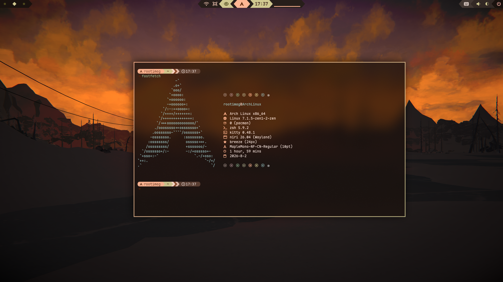

# Dotfiles from Rootimag: The Most Beautiful Configuration File

[](https://github.com/InioX/matugen)
[](https://opensource.org/licenses/MIT)

这是我的个人配置文件仓库。同时配有安装脚本，可供快速安装

---

## 项目结构

```
.
├── scripts/                # 共用脚本，包括 matugen 更新和截图
├── matugen/                # matugen 色彩动态更新 (模板与配置)
├── niri/                   # niri 窗口管理器配置
├── rofi/                   # rofi 启动器配置
├── waybar/                 # waybar 状态栏配置
├── pywalfox/               # firefox 动态色彩定制
├── gtk/                    # gtk 界面主题配置
├── kitty/                  # kitty 终端配置
├── nvim/                   # nvim 编辑器配置
├── mako/                   # mako 通知守护进程配置
├── yazi/                   # yazi 终端文件管理器配置
├── zsh/                    # zsh 终端环境配置
├── wlogout/                # wlogout 注销界面配置
├── fastfetch/              # fastfetch 快速获取系统信息
├── hyprlock/               # hyprlock 系统锁屏配置
└── wallpaper/              # 壁纸资源库 (最喜欢的壁纸)
```

---

## 预览


